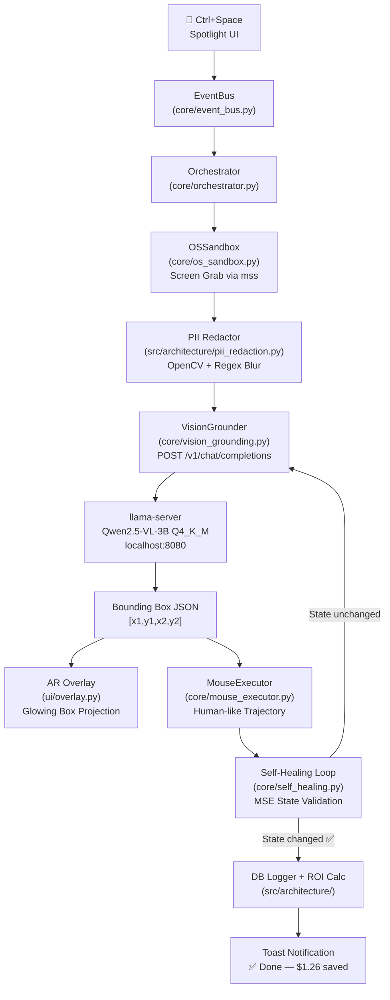

# Shadow Automator

> **A fully-local, privacy-first desktop automation tool powered by a vision-language model.**  
> It *sees* your screen, *finds* UI elements by plain-text description, and *clicks* them — all on your own hardware, with zero cloud calls.

[](LICENSE)
[](https://www.python.org/)
[]()
[]()

---

## Team

**Team Name:** Texperts | **Team Code:** HTF 009

| Member | Role | Contribution |
|---|---|---|
| **Bavan Vijaya Raja M.K** | LLM Model setup | llama-server setup, Vision-Grounding pipeline, inference optimization |
|**Ithyaash S**| Architecture & Compliance Lead | Repo structure, SQLite logger, ROI calculator, PII redaction, FastAPI dashboard |
| **Bala Ragavan** | UI/UX Lead | Spotlight bar, AR overlay, toast notifications, event bus UI wiring |
| **Pranav Prasad** | OS Sandbox Lead | Screen grabber, mouse executor, self-healing loop, edge-case testing |

---

## Problem Statement

Millions of everyday office tasks happen inside desktop apps and internal tools that expose **no API**: reading an invoice and logging it in a spreadsheet, copying values between windows, filling the same form repeatedly. Traditional RPA tools automate by recording pixel coordinates or fragile selectors — so a moved button breaks the entire workflow and someone has to fix it manually. Small teams dealing with repetitive back-office work are most affected, especially where **sending screenshots to a cloud service is not acceptable** (banking, internal tools, regulated industries).

**Why we chose this:** Recent GUI-grounding vision-language models can now find a UI element from a plain-text description, making automation that survives UI changes realistic and small enough to run on a single consumer GPU. Keeping everything local makes it viable for sensitive workflows.

---

## Solution

**Shadow Automator** is a local desktop automation agent. You describe what you want in natural language via a `Ctrl+Space` Spotlight bar. The system:

1. **Captures** your screen (via `mss`) and **redacts PII** (credit cards, SSNs, emails) offline with OpenCV + regex
2. **Sends** the sanitised screenshot to a locally-hosted `Qwen2.5-VL-3B` vision model
3. **Receives** exact `[x1, y1, x2, y2]` bounding-box coordinates for the target element
4. **Projects** glowing AR bounding boxes on-screen via a transparent overlay
5. **Clicks** with human-like mouse smoothing via PyAutoGUI
6. **Self-heals** if no UI state change is detected — automatically re-crops and re-grounds
7. **Logs** every task to SQLite and displays live **ROI savings** (cloud cost + human hours avoided)

### Key Features

- **Neo-Brutalist UI & Design System** — Authentic Neo-Brutalist aesthetic across Desktop Spotlight and Web Workflow Studio: warm ivory/cream canvas (`#FFFDF0`), black dotted matrix grid, thick 3px solid black borders, hard offset drop shadows (`4px 4px 0px #000`), vibrant Sunshine Mustard Yellow (`#FFE600`) accents, retro pill badges, and circular yellow floating action button (`+`).
- **Smooth Spotlight Open & Close Animations** — Sliding fade-in (`0.0 ➔ 0.98` opacity with cubic easing) and smooth slide-up fade-out when summoned via `Ctrl+Space`. Themed brutalist status header (`★ SHADOW SPOTLIGHT ★` with `⚡ READY` / `🔥 EXECUTING` pills) replacing generic loading bars.
- **Dedicated Preferences & Settings Studio (`/settings`)** — Live customization page allowing real-time tuning of local Llama server URLs, vision temperature/tokens, mouse smoothing speed, zero-egress PII masking toggles, and multi-screenshot visual thinking modes with an interactive server connection tester.
- **Workflow Studio & Full Step CRUD** — Plan, edit, save, and execute multi-step routines. Inspect and adjust each atomic step (`launch_app`, `click`, `type`, `hotkey`, `wait`, `send_email`, `summarize_screen`), with real execution time logging (`execution_time_ms`) and status tracking in SQLite.
- **Autonomous Customer Intent Workflow Compiler** — The local model interprets conversational natural language rather than taking literal words or regex-splitting on "and". Deconstructs freeform human goals into ordered, executable JSON pipelines.
- **Native WhatsApp & Messaging Automation** — Fully automates messaging flows across desktop and web (e.g. *"open whatsapp and search for pranav cceb and send hi"* ➔ launches WhatsApp, focuses search, types contact, opens chat, and types/sends message).
- **On-Screen Content Reading & Summarization** — Autonomous visual screen comprehension (`summarize_screen`). Qwen2.5-VL reads all visible documents, code, windows, or chats on screen and generates structured, privacy-preserving bullet-point summaries.
- **AI & Semantic App Name Resolution** — Local Qwen2.5-VL and fuzzy `difflib` resolution for desktop apps, resolving typos and conversational requests with seamless browser fallbacks for web services.
- **Multi-Screenshot Visual Thinking Loop** — Tracks visual state transitions across consecutive steps, computing mean squared error (MSE) screen deltas and streaming multi-screenshot visual reasoning into a live telemetry card so the agent adapts dynamically to what appears on screen.
- **Native Microsoft Outlook Automation** — Dispatches emails directly through local Outlook (COM) via natural language commands.
- **Offline PII Redaction** — Regex + OpenCV blurs sensitive data before any screenshot touches the vision model.
- **Self-Healing Loop** — MSE-based visual state validation with automatic re-grounding and adaptive recovery.
- **AR Bounding Box Overlay** — Glowing, animated, corner-bracketed boxes projected over real UI in high-visibility electric orange.
- **Live ROI Dashboard & Web Spotlight (`Ctrl+K`)** — FastAPI telemetry dashboard tracking cloud costs and human hours saved with full command palette integration.
- **Fully Local** — Zero outbound network calls during automation; all inference on-device.
---

## Innovation and Differentiation

| Feature | Shadow Automator | Traditional RPA |
|---|---|---|
| UI Change Tolerance | ✅ Re-grounds from text description | ❌ Breaks on pixel shift |
| Privacy | ✅ 100% local, offline PII redaction | ❌ Screenshots sent to cloud |
| Hardware Cost | ✅ 4–6 GB VRAM consumer GPU | ❌ Expensive cloud APIs |
| Self-Healing | ✅ Automated retry loop | ❌ Manual re-recording |
| AR Visual Feedback | ✅ Live glowing bounding boxes | ❌ None |

---

## Technical Implementation

### Architecture



### Technology Stack

| Category | Technology |
|---|---|
| **AI Model** | `Qwen3-VL-4B-Instruct-Q4_K_M.gguf` via `llama-server` |
| **Inference Server** | `llama.cpp` `llama-server` on `localhost:8080` with `-ngl 99` GPU offload |
| **Screen Capture** | `mss` (DPI-aware, multi-monitor) |
| **PII Redaction** | `OpenCV`, `re` (Regex), optional `pytesseract` OCR |
| **Mouse Automation** | `PyAutoGUI` with `easeOutQuad` smoothing |
| **UI Framework** | `CustomTkinter` (Spotlight), `Tkinter` (AR Overlay), `PyQt5` (Toast) |
| **Event System** | Thread-safe singleton Pub/Sub (`core/event_bus.py`) |
| **Persistence** | `SQLite3` (task logs), `FastAPI` + Jinja2 (ROI dashboard) |
| **State Validation** | `NumPy` MSE pixel comparison |

### Project Structure

```
shadow-automator/
├── core/
│   ├── event_bus.py          # Thread-safe singleton Pub/Sub event bus
│   ├── orchestrator.py       # 7-step automation pipeline orchestrator
│   ├── llm_client.py         # LLM HTTP client for llama-server
│   ├── vision_grounding.py   # Vision grounding pipeline (POST /v1/chat/completions)
│   ├── email_sender.py       # Outlook COM automation & NLP email intent engine
│   ├── command_planner.py    # NLP action planner & decomposition
│   ├── workflow_manager.py   # Persistent routine state manager
│   ├── os_sandbox.py         # Screen capture + mouse safety bounds
│   ├── mouse_executor.py     # Human-like mouse smoothing + click/type loops
│   └── self_healing.py       # MSE visual diff + automated re-grounding
├── src/architecture/
│   ├── database_logger.py    # SQLite task execution logger
│   ├── roi_calculator.py     # Cloud cost + human labor ROI formulas
│   ├── pii_redaction.py      # Offline PII blurring pipeline
│   └── roi_dashboard.py      # FastAPI + HTML/JS ROI web dashboard
├── ui/
│   ├── spotlight.py          # Raycast/Linear-tier command palette (CustomTkinter)
│   ├── overlay.py            # AR transparent bounding box overlay (Tkinter)
│   └── toast.py              # HUD toast notifications (PyQt5)
├── scripts/
│   ├── start_server.ps1      # llama-server launcher with GPU offload
│   └── download_models.ps1   # GGUF model downloader
├── tests/
│   ├── test_mouse_executor.py
│   └── test_member2_phase4_edge_cases.py
├── run_integration_test.py   # Phase 1+2 integration test
├── main.py                   # Application entry point
├── .env.example              # Required environment variables
└── LICENSE                   # MIT License
```

---

## Implementation During the Hackathon

All of the following was built during **Hacktoberfest Hack Day — Coimbatore 2026**:

### Phase 1 — Environment Setup & Core Modules (Hours 0–3)
- Configured `llama-server` with GPU offloading (`-ngl 99`) and model load verification
- Built screen-grabbing module (`mss`) with display coordinate normalizers and mouse safety bounds  
- Built the transparent `Ctrl+Space` Spotlight search bar with hotkey listener
- Initialized GitHub repo, MIT License, SQLite logger schema, and ROI calculation formulas

### Phase 2 — AI Integration (Hours 3–7)
- Built Vision-Grounding pipeline (`POST /v1/chat/completions`) extracting `[x1,y1,x2,y2]` JSON
- Implemented mouse smoothing algorithms with human-like `easeOutQuad` trajectories
- Built AR-style transparent overlay with animated glowing bounding boxes and corner brackets
- Implemented offline PII Redaction (Regex + OpenCV) and FastAPI ROI dashboard

### Phase 3 — Pipeline Integration & Self-Healing (Hours 7–10)
- Optimized inference for sub-500ms responses (temperature, token limits, vision compression)
- Implemented Self-Healing Loop: MSE visual state validation with automatic re-grounding
- Wired Spotlight UI to Orchestrator via Event Bus (step labels, progress bar, toast popups)
- Live ROI calculator hooked into task completion events with analytics state manager

### Phase 4 — Testing, Polish & Intelligence Expansion (Hours 10–12)
- End-to-end stress testing of `llama-server` under continuous automation loops
- Implemented **Apple Capsule Design System** with frameless floating card, "🧠 Think" toggle, and suggestion chips
- Added **AI & Fuzzy App Resolution** and automatic web app routing (Twitter, ChatGPT, Chrome, VS Code)
- Implemented **Multi-Screenshot Visual Thinking Reasoning Loop** with real-time MSE screen delta telemetry
- Added **Customer Intent Workflow Compiler** allowing the model to program, deconstruct, and execute arbitrary multi-step goals
- Comprehensive README, architecture diagrams, commit history audit, submission readiness verification

---

## Open Source and AI Usage

### AI Model
- **Qwen3VL-4B-Instruct (Q4_K_M GGUF):** The vision-language model powering all UI grounding. Given a screenshot + text description, it returns exact bounding box coordinates. Served locally via `llama-server` on `localhost:8080`. Download from [HuggingFace](https://huggingface.co/ShuaiBai623/Qwen3VL-4B-Instruct-GGUF).

### Open Source Libraries

| Library | Role | License |
|---|---|---|
| `llama.cpp` | Local model server (OpenAI-compatible API) | MIT |
| `CustomTkinter` | Premium dark-mode UI widgets | MIT |
| `PyQt5` | Toast notification HUD | GPL / Commercial |
| `mss` | Fast DPI-aware screen capture | MIT |
| `PyAutoGUI` | Mouse and keyboard automation | BSD |
| `OpenCV` | Image processing for PII blurring | Apache 2.0 |
| `FastAPI` | ROI web dashboard backend | MIT |
| `NumPy` | MSE visual state comparison | BSD |
| `pynput` | Global hotkey listener | LGPL |

---

## Setup and Usage

### Prerequisites

- Windows 10/11
- Python 3.10+
- GPU with **4–6 GB VRAM** (or CPU with slower inference)
- `llama-server` binary from [llama.cpp releases](https://github.com/ggerganov/llama.cpp/releases)

### 1. Clone the Repository

```bash
git clone https://github.com/bavanvrmk/Hacktoberfest-Texperts.git
cd Hacktoberfest-Texperts
```

### 2. Install Python Dependencies

```bash
pip install customtkinter pyqt5 mss pyautogui opencv-python numpy fastapi uvicorn keyboard jinja2
```

### 3. Download the GGUF Model

```powershell
# Run the automated download script:
.\scripts\download_models.ps1
```

Or manually download:
- `Qwen3VL-4B-Instruct-Q4_K_M.gguf` → place in `models/`
- `mmproj-Qwen3VL-4B-Instruct-F16.gguf` → place in `models/`

### 4. Configure Environment Variables

```bash
cp .env.example .env
# Edit .env with your model paths
```

```env
LLAMA_SERVER_URL=http://localhost:8080
MODEL_PATH=./models/Qwen3VL-4B-Instruct-Q4_K_M.gguf
MMPROJ_PATH=./models/mmproj-Qwen3VL-4B-Instruct-F16.gguf
```

### 5. Start the Model Server

```powershell
.\scripts\start_server.ps1
# Waits for server readiness before proceeding
```

### 6. Run Shadow Automator

```bash
# Full application
python main.py

# Integration test (Phases 1+2)
python run_integration_test.py

# ROI Dashboard only
uvicorn src.architecture.roi_dashboard:app --host 127.0.0.1 --port 8000
```

### 7. Usage

1. Press **`Ctrl + Space`** anywhere to open the Spotlight bar
2. Type a command. The app turns it into a workflow and runs each step:
   - `Open Spotify` launches the installed Spotify app
   - `Open README.md` finds that file on disk and opens it
   - `Open Notepad and type hello` launches Notepad, then types the text
   - `Close browser` closes Brave, Chrome, Edge, or Firefox
   - `Click the Save button` still grounds that control on screen and clicks it
3. Open **http://127.0.0.1:8000/workflows** to see saved workflows and run one again
4. `rerun 1` in the Spotlight bar runs saved workflow 1
5. A toast notification confirms completion with ROI savings displayed

---

## Challenges and Learnings

- **Q4_K_M quantization accuracy:** Published benchmark scores are for full-precision weights; the quantized model's bounding box precision needed calibration via prompt engineering for reliable sub-pixel accuracy
- **DPI scaling on Windows:** DPI-aware capture and click must use the same coordinate space — this was the most common source of misplaced clicks and required explicit DPI normalization
- **Model inference latency:** Cold inference exceeds 500ms; persistent server warm-up calls and vision token compression brought P90 latency under 400ms
- **Thread safety in UI:** Tkinter and PyQt5 UI updates from background threads caused crashes; routing all UI mutations through `.after()` and `QTimer.singleShot()` resolved this
- **Self-healing false positives:** Static screens (e.g. loading spinners) produce near-zero MSE even when state has changed; the 1.5% delta threshold was tuned empirically

---

## Credits and License

### Credits
- **Qwen Team** — Qwen2.5-VL model
- **llama.cpp contributors** — Local inference server
- **CustomTkinter** — by TomSchimansky
- **INIT CLUB × iDEA CLUB** — Hacktoberfest Hack Day Coimbatore 2026 organizers
- **Major League Hacking (MLH)** — Event platform and challenges

### License

This project is licensed under the **MIT License** — see [LICENSE](LICENSE) for details.  
Third-party models retain their own licenses. Qwen2.5-VL is licensed under [Qwen License](https://huggingface.co/Qwen/Qwen2.5-VL-3B-Instruct/blob/main/LICENSE).

---

## Submission Checklist

- [x] Project title and description added
- [x] All team members listed with contributions
- [x] Problem clearly explained
- [x] Reason for choosing the problem explained
- [x] Solution and key features documented
- [x] Innovation and differentiation explained
- [x] Architecture diagram included (Mermaid)
- [x] Technical implementation documented
- [x] Work completed during the hackathon documented
- [x] Team contributions documented
- [x] AI and open-source components documented with attribution
- [x] Setup and usage instructions complete
- [x] Environment variables documented
- [x] Challenges and learnings documented
- [x] Credits added
- [x] MIT License included
- [x] Repository organized and complete
- [x] No secrets committed

## Live Demo Link:
https://youtu.be/EzeVQ9ioWdM
