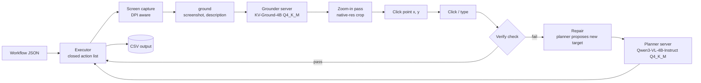

# Shadow Automator

> A local, API-free desktop automation tool that replays workflows by *seeing* the screen, and is designed to self-repair when the UI changes.

**Project status:** the planning and design phase is complete. Implementation is not finished yet. This README describes the designed solution, and sections that depend on working code say so explicitly.

## Team

**Team Name:** Texperts  
**Team Code:** HTF 009

| Member | Role | Institution | Email | Contribution |
| ------ | ---- | ----------- | ----- | ------------ |
| **Bavan Vijaya Raja M.K** | Leader | Amrita Vishwa Vidyapeetham | cb.en.u4cce25107@cb.students.amrita.edu | [Contribution] |
| **Pranav Prasad** | Team Member | Amrita Vishwa Vidyapeetham | cb.en.u4cce25132@cb.students.amrita.edu | [Contribution] |
| **Ithyaash S** | Team Member | Amrita Vishwa Vidyapeetham | cb.en.u4cce25023@cb.students.amrita.edu | [Contribution] |
| **Bala Ragavan K** | Team Member | Amrita School of Engineering (Coimbatore) | cb.en.u4cce25011@cb.students.amrita.edu | [Contribution] |


## Problem Statement

### The Problem

Many everyday office tasks happen inside desktop apps and internal tools that expose no API: reading an invoice number from an email and logging it in a spreadsheet, copying values between windows, filling the same form again and again. Traditional RPA tools automate these by recording pixel positions or fragile selectors, so a moved or renamed button breaks the whole workflow and someone has to fix it by hand. Small teams and individuals doing repetitive back-office work are the most affected, especially where sending screenshots to a cloud service is not acceptable (banking, internal tools).

### Why We Chose This Problem

Brittle UI automation is a daily pain, and recent GUI-grounding models can now find a UI element from a plain-text description. That makes automation that survives UI changes realistic, and small enough to run on a single consumer GPU. Keeping everything local also makes it usable for sensitive workflows.

## Solution

Shadow Automator is designed to replay a workflow stored as a simple JSON file. Each click step carries a text description of its target (for example, "Save button at the bottom of the tracker form"). A grounding model, `ground(screenshot, description) -> (x, y, confidence)`, finds that element on the current screen, so the workflow keeps working after a button is moved or renamed. A small planner model handles the tasks around it: describing targets, proposing repairs and extracting fields. It returns schema-constrained JSON only and never writes code.

The planned demo is one hardcoded workflow: an email arrives, the invoice number is read, and it is appended to a CSV. We then deliberately move or rename a button, show the replay failing, and show it recovering.

### Key Features

These are the designed features of the system (not yet implemented):

- **Describe-and-find grounding:** clicks are located from a text description, with no stored pixel coordinates.
- **Two-pass zoom-in:** predict on a downscaled full screen, crop around the guess at native resolution, and predict again. The grounder's published results go from 73.2 to 80.5 on ScreenSpot-Pro with this step.
- **Verify after every click:** a failed check stops the run instead of continuing blindly, which also triggers repair.
- **Safe by design:** a closed action vocabulary (`click`, `type`, `hotkey`, `wait`, `extract`, `open_app`), no generated code, dry-run mode, a kill hotkey, and everything running locally with no outbound network calls during replay.

## Innovation and Differentiation

- **Self-repair instead of re-recording.** When the UI changes, the grounder re-finds the target from its description and the planner can propose a new target for the user to confirm.
- **Closed vocabulary.** The workflow format is a fixed list of actions executed by plain Python, and models only fill in click targets. This is what makes it reasonable to run on sensitive tools.
- **Designed for a 10 GB GPU, fully local.** Two small Q4_K_M models are kept resident behind local HTTP servers, so no model loading happens during a run.
- **Pluggable backends.** Every model sits behind one `ground()` interface, so contributors can add other grounders (GUI-Owl, OmniParser) without touching the executor.

## Technical Implementation

### Architecture

The diagram shows the planned design.



### Technology Stack

Planned stack:

| Category        | Technologies                                                              |
| --------------- | ------------------------------------------------------------------------- |
| Frontend        | N/A                                                                       |
| Backend         | Python, llama.cpp `llama-server` (two persistent local servers)           |
| Database        | N/A (output is appended to a CSV file)                                    |
| AI / ML         | KV-Ground-4B (Q4_K_M), Qwen3-VL-4B-Instruct (Q4_K_M)                      |
| Infrastructure  | Local machine, Windows with DPI-aware screen capture                      |
| APIs / Services | Local OpenAI-compatible HTTP endpoints on localhost only                  |

### How It Works

1. A persistent grounder server and a planner server are started and warmed with one dummy request before a run, so the models never load during a workflow.
2. The executor reads the workflow JSON and runs each step from the fixed action list.
3. For a click step, it captures the screen and calls `ground()` with the step's text description. The grounder returns a point, and a second zoom-in pass on a native-resolution crop refines it. Coordinates are mapped back to real screen pixels in one place, inside `ground()`.
4. After the click, a verify check confirms the expected result. If it fails, the run stops and the repair path begins.
5. For repair, the planner returns schema-constrained JSON with a proposed new target description, which the user confirms.

Example workflow step:

```json
{"id": 2, "action": "click",
 "target": {"describe": "Save button at the bottom of the tracker form"},
 "verify": {"window_title_contains": "Tracker"}}
```

### Technical Decisions

- **Persistent servers, no per-run loading.** Both models stay resident behind local HTTP, with a warm-up call at startup. Loading the model inside the workflow script was ruled out.
- **Q4_K_M quantization for both models.** Chosen to fit a 10 GB GPU (roughly 7-8.5 GB total by our estimate, not yet measured). The vision projector is to be kept at higher precision where possible, since quantizing it harder is a likely source of click offsets.
- **Zoom-in pass only where needed.** It is skipped when the target is large or the first pass is confident, to save latency.
- **Planner never writes code or returns pixels.** It only emits JSON under a schema, with one retry.
- **One `ground()` function for all backends.** This keeps the executor independent of the model and makes new backends easy to add.
- **DPI awareness first.** Capture and click happen in the same coordinate space to avoid the most common cause of misplaced clicks on Windows.
- **Scope cut for the hackday.** One hardcoded workflow, one grounder, a hand-written workflow JSON, and one live repair demo. Accessibility-API adapters, screen-watching record mode and multi-model planning are deferred.

## Implementation During the Hackathon

The work is not complete. During the Hack Day we finished the **planning and design phase**:

- Defined the scope for a one-day build: one hardcoded invoice-to-CSV workflow, one grounder, a hand-written workflow JSON and one live repair demo.
- Designed the fallback ladder (accessibility selector, template match, grounder with zoom-in, repair) and decided to build only the grounder tier first.
- Chose the model setup: KV-Ground-4B and Qwen3-VL-4B-Instruct, both Q4_K_M, each in its own persistent local server to avoid load time.
- Designed the closed-vocabulary workflow JSON format and the safety defaults (dry-run, confirmation for sensitive apps, app allowlist, kill hotkey, local-only operation).
- Planned the repo layout (`core/`, `backends/`, `adapters/`, `eval/`, `examples/`) and the contributor issue list.

**Still to build:** the `ground()` wrapper with coordinate mapping and zoom-in pass, the workflow executor with verify-after-click, the invoice-to-CSV workflow, the deliberate-break repair demo, and a backup screen recording.

**Planned for later (contributor issues):**

- Accessibility-API adapters (Windows UI Automation) as the fast first tier, with the grounder as fallback.
- Template matching as a second tier.
- Screen-watching record mode.
- Gmail, Outlook and Excel adapters.
- GUI-Owl and OmniParser backends, and a labeled screenshot eval set.

### Team Contributions

- **Bavan Vijaya Raja M.K (Leader):** [Contribution]
- **Pranav Prasad:** [Contribution]
- **Ithyaash S:** [Contribution]
- **Bala Ragavan K:** [Contribution]

## Working Application

**Live Application:** N/A

Not available yet. Shadow Automator is a local tool with no hosted version, and the implementation is still in progress.

## Demo Video

**Demo Video:** Not available yet

The planned demo shows the invoice-to-CSV workflow replaying end to end, then a button being moved or renamed, the replay failing its verify check, and the grounder and repair step recovering.

## Open Source and AI Usage

### AI / Models

- **KV-Ground-4B (Q4_K_M):** the planned grounder. Given a screenshot and a text description, it returns the click point, and is run again on a zoom-in crop for refinement.
- **Qwen3-VL-4B-Instruct (Q4_K_M):** the planned planner. It describes targets, proposes repairs and extracts fields, returning only schema-constrained JSON.

### Open Source Components

- **llama.cpp (`llama-server`):** to serve both models locally over an OpenAI-compatible HTTP API.
- **Python:** executor and model wrappers.
- **Possible later additions:** OmniParser v2 (detector is AGPL, captioner is MIT, to be kept as a separate optional install), a GUI-Owl backend, Windows UI Automation via pywinauto, OpenCV for template matching.

KV-Ground is licensed CC BY-NC-SA 4.0 (non-commercial). Model weights will not be committed to the repository; they should be downloaded from the original model pages with their licenses respected.

## Setup and Usage

> Not yet available. The steps below are the intended setup and have not been tested.

### Prerequisites

- Windows
- Python 3.10+
- A GPU with about 10 GB VRAM
- A recent `llama.cpp` build with `llama-server`
- Q4_K_M GGUF files and `mmproj` files for KV-Ground-4B and Qwen3-VL-4B-Instruct

### Installation

```bash
git clone [repository-url]
cd [project-directory]
[installation-command]
```

### Environment Variables

```env
GROUNDER_SYSTEM_PROMPT_FILE=path/to/grounder_system_prompt.txt
```

The grounder's system prompt should match the authors' exact format from the KV-Ground repository.

### Running the Project

```bash
[run-command]
```

### Usage

Planned flow: start the grounder and planner servers and let the warm-up finish, run the workflow in dry-run mode to see each target highlighted, then run it for real. A kill hotkey stops the run at any time.

## Devpost Submission

**Devpost Project:** [Devpost Project URL]

## Challenges and Learnings

- Published benchmark scores are for full-precision weights, so Q4_K_M accuracy needs to be measured on our own labeled screenshots before relying on it.
- The grounder's prompt format and coordinate convention must match the authors' code, or clicks will land in the wrong place.
- Model load time is the main cost in a one-day demo, which is why both models are designed to stay resident.
- DPI scaling mismatches are the most common cause of misplaced clicks on Windows.
- A one-day build forces hard scope cuts, so we chose a single workflow and a single grounder tier.

## Credits and License

### Credits

- KV-Ground (grounding model) and its authors
- Qwen3-VL (Qwen team)
- llama.cpp contributors

### License

[Repository license]. Third-party models keep their own licenses: KV-Ground is CC BY-NC-SA 4.0 (non-commercial).

## Submission Checklist

- [x] Project title and description added
- [x] All team members listed
- [x] Problem clearly explained
- [x] Reason for choosing the problem explained
- [x] Solution and key features documented
- [x] Innovation and differentiation explained
- [x] Architecture included
- [x] Technical implementation documented
- [x] Work completed during the hackathon documented
- [ ] Team contributions documented
- [ ] Working application is functional
- [ ] Live application link added where applicable
- [ ] Demo video added
- [x] AI and open-source components documented
- [ ] Setup and usage instructions tested
- [x] Challenges and learnings documented
- [ ] Devpost submission completed
- [ ] Devpost link added
- [x] Credits added
- [ ] License added
- [ ] Repository is organized and complete
